```{r setup, include=FALSE}
knitr::opts_chunk$set(echo = TRUE)
```

# Foreword

This RMarkdown file compiles my exercise attempts (and failures) under the Seminar component of the **Decision Analysis and Forecasting** module under Professor Whitney and Luedeling for Summer Semester 2023. Tools used include *decisionAnalysis* package developed by the team running the course module.

# Exercise 2

*Data wrangling*

In this code chunk, I just tested the functions being discussed in [data wrangling part 2](https://agtools.app/learning_r/#section-data-wrangling-part-2); I will not be showing the tables or results unless instructed (because it would be tiresome to show every data and pages will be too lengthy). Data used in this section is from CWWhitney's github [here](https://raw.githubusercontent.com/CWWhitney/teaching_R/master/participants_data.csv).

I used R before but I never used the *tidyverse* package, so that was new to me. Very useful package, I might say.

```{r, eval=FALSE}
library(tidyverse)
library(dplyr)
library(tidyr)
library(magrittr)
library(purrr)
#browseVignettes("tidyverse")

#reading data and assigning to a variable
participants_data<- read.csv("data/participants_data.csv")

#checking first 7 columns of the data
head(participants_data,n=7)

#checking the column names of the data
names(participants_data)

#checking data structure per column
str(participants_data)

#calling variable 'gender'
participants_data$gender

#select batch and age
select(participants_data, batch, age)

#select all except batch and age
select(participants_data,-batch,-age)

#selecting those who work more than 5 hours a day
filter(participants_data, working_hours_per_day>5)

#selecting those who work more than 5 hours a day and have names longer than 3 letters
filter(participants_data, working_hours_per_day>5 & letters_in_first_name>3)

#renaming 'km_home_to_zef' to 'commute'
rename(participants_data, commute=km_home_to_zef)

#mutating a new column 'age_mean' as function of 'age' and mean of the ages
mutate(participants_data, age_mean=age*mean(age))

#mutating a new column 'response_speed' populated by 'slow' if it takes >1 day to answer email else 'fast'
mutate(participants_data, response_speed=
         ifelse(days_to_email_response>1,'slow','fast'))

#summary of participants_data with mean number of siblings and median years of study
summarize(participants_data,mean(number_of_siblings), median(years_of_study))

##using magrittr: groupby function
#mean days to email response,
#median letters in first name,
#maximum years of study by gender
participants_data %>%
  group_by(gender) %>%
  summarize(mean(days_to_email_response),
            median(letters_in_first_name),
            max(years_of_study))


# new column called 'commute', where those who travel 
# more than 10km to get to the office 
# are called "commuter" and others are "local". 
# Summarize the mean days to email response, 
# median letters in first name, 
# and maximum years of study. 
participants_data<- read.csv("data/participants_data.csv")
participants_data %>%
  mutate(commute=ifelse( 
           km_home_to_zef>10, 'commuter', 'local')) %>%
           group_by(gender) %>%
           summarize(mean(days_to_email_response), 
            median(letters_in_first_name), 
            max(years_of_study))

##using purrr library
# Split the data frame by batch, 
# fit a linear model formula 
# (days to email response as dependent 
# and working hours as independent) 
# to each batch, compute the summary, 
# then extract the R^2.
participants_data %>%
  split(.$batch) %>%
  map(~
        lm(working_hours_per_day ~ 
             days_to_email_response, 
           data=.)) %>%
  map(summary) %>%
  map_dbl("r.squared")

```

An exception, because 'summarize' function is short, here's the summary based on mean of 'number_of_siblings' and median of years_of_study:

```{r, echo=FALSE}

library(tidyverse)
library(dplyr)
library(tidyr)
library(magrittr)
library(kableExtra)

participants_data<- read.csv("data/participants_data.csv")

summary1<-summarize(participants_data,mean(number_of_siblings), median(years_of_study))

head(summary1)
```

Extracted R\^2 for the 'participants_data' dataset:

```{r, echo=FALSE}
library(tidyverse)
library(dplyr)
library(tidyr)
library(magrittr)
library(purrr)
library(kableExtra)

participants_data<- read.csv("data/participants_data.csv")


r_squared<-participants_data %>%
  split(.$batch) %>%
  map(~
        lm(working_hours_per_day ~ 
             days_to_email_response, 
           data=.)) %>%
  map(summary) %>%
  map_dbl("r.squared")

head(r_squared)
```

Now onto the real exercise using the 'diamonds' dataset in-built in R:

```{r, eval=FALSE}
library(tidyverse)
library(dplyr)
library(tidyr)
library(magrittr)
library(purrr)
library(kableExtra)

#selecting carat and price
select(diamonds, carat, price)

#filter when carat>0.5
filter(diamonds, carat>0.5)

#rename price as cost
rename(diamonds, cost=price)

#mutate a variable populated with 'expensive' if >mean of cost, else 'cheap'
mutate(diamonds,
         valuation=ifelse(
           price>mean(price),'expensive','cheap'))

#split into cheap and expensive
#I created a new dataset with the mutated 'valuation' column before using the group_by function
new_diamonds<-diamonds %>%
  mutate(valuation=ifelse(
           price>mean(price),'expensive','cheap'))
  
new_diamonds %>%
  group_by(valuation)
  
#summarize using any statistics
summarise(diamonds, mean(price), median(carat))

#using magrittr
diamonds %>%
  mutate(valuation=ifelse( 
          price>mean(price),'expensive','cheap')) %>%
           group_by(valuation) %>%
           summarize(mean(price), median(carat))


```

A look into the summary of 'diamonds' dataset using mean of price and median of carat, grouped by valuation (cheap or expensive):

```{r, echo=FALSE}

library(tidyverse)
library(dplyr)
library(tidyr)
library(magrittr)


summary2<-diamonds %>%
  mutate(valuation=ifelse( 
          price>mean(price),'expensive','cheap')) %>%
           group_by(valuation) %>%
           summarize(mean(price), median(carat))

head(summary2)
```

# Exercise 3

*Data visualization*

These exercises make use of the 'participants_data' dataset from CWWhitney's github [here](https://raw.githubusercontent.com/CWWhitney/teaching_R/master/participants_data.csv), Anderson's iris data set, 'mpg' dataset, and ggplot's 'diamonds' dataset.

```{r,eval=FALSE}

library(tidyverse)
library(dplyr)
library(tidyr)
library(magrittr)
library(kableExtra)
library(ggplot2)

#reading data and assigning to object
participants_data<- read.csv('data/participants_data.csv')

#choosing one column to plot
participants_barplot<-table(participants_data$gender)

#making barplot
plot1<-barplot(participants_barplot)

# creating a scatterplot of days to email response (y) 
# as a function of the letters in your first name (x) 
ggplot(data=participants_data,
       aes(x=letters_in_first_name,
           y=days_to_email_response)) +
  geom_point()


# Creating a scatterplot of days to email response (y) 
# as a function of the letters in your first name (x) 
# with colors representing binary data 
# related to academic parents (color) 
# and working hours per day as bubble sizes (size)
ggplot(data = participants_data, 
       aes(x = letters_in_first_name,, 
           y = days_to_email_response, 
           color = academic_parents, 
           size = working_hours_per_day)) + 
  geom_point()


##using 'iris' dataset
# creating a scatterplot of iris petal length (y) 
# as a function of sepal length (x) 
# with colors representing iris species (color) 
# and petal width as bubble sizes (size)
ggplot(data = iris, 
       aes(x = Sepal.Length, 
           y = Petal.Length, 
           color = Species, 
           size = Petal.Width))+ 
  geom_point()


##using 'diamonds' dataset
# creating a plot with the diamonds data 
# of the carat (x) and the price (y)
plot1 <- ggplot(data = diamonds, 
                aes(x = carat, y = price, 
                    alpha = 0.2)) +
          geom_point()

# Create a plot with the diamonds data 
# of the log of carat (x) 
# and the log of price (y)
ggplot(data = diamonds,
       aes(x = log(carat),
           y = log(price),
           alpha = 0.2)) +
  geom_point()

# creating a smaller diamonds data set (top 100 rows), 
# creating a scatterplot with carat on the x-axis 
# and price on the y-xis and 
# with the color of the diamond as the color of the points
d_small<-top_n(diamonds, n=100)

ggplot(data=d_small, aes(x=carat,
                         y=price,
                         color=color)) +
  geom_point()


# creating a smaller diamonds data set (top 40 rows), 
# creating a scatterplot with carat on the x-axis 
# and price on the y-xis and 
# with the cut of the diamond as the shapes for the points. 
dsmall <- top_n(diamonds, 
                n = 40)

ggplot( data = dsmall, 
        aes(x = carat, 
            y = price, 
            shape = cut)) + 
  geom_point()

# creating a plot of the diamonds data 
# with carat on the x-axis, price on the y-axis. 
# Use the inhibit function to set the alpha to 0.1 
# and color to blue.
ggplot(data = diamonds, 
       aes(x = carat, 
           y = price, 
           alpha = I(0.1), 
           color = I("blue"))) + 
  geom_point()

# creating a smaller data set of diamonds with 50 rows. 
# creating a scatterplot and smoothed conditional 
# means overlay with carat on the x-axis 
# and price on the y-axis.
dsmall <- top_n(diamonds, 
                n = 50)

ggplot(data = dsmall, 
       aes(x = carat, 
           y = price))+
geom_point()+
geom_smooth()


# creating a smaller data set of diamonds with 50 rows. 
# creating a scatterplot and smoothed conditional 
# means overlay with carat on the x-axis 
# and price on the y-axis.
# Use 'glm' as the option for the smoothing
dsmall <- top_n(diamonds, 
                n = 50)

ggplot(data = dsmall, 
       aes(x = carat, 
           y = price))+ 
  geom_point()+ 
geom_smooth(method = 'glm')

# changing the boxplot so that the x-axis is cut and
#  the y-axis is price divided by carat
ggplot(data = diamonds, 
       aes(x = cut, 
           y = price/carat)) + 
geom_boxplot()

# jittered boxplot: x-axis is cut and
#  the y-axis is price divided by carat
ggplot(data = diamonds, 
       aes(x = cut, 
           y = price/carat)) + 
geom_boxplot()+ 
geom_jitter()

# Changing the alpha to 0.4 to make 
# the scatter less transparent
ggplot(data = diamonds, 
       aes(x = cut, 
           y = price/carat, 
           alpha = I(0.4))) + 
geom_boxplot()+ 
geom_jitter()

# Changing the density plot so that the x-axis is carat 
# and the color is the diamond color
ggplot(data = diamonds, 
       aes(x = carat, color=color)) +
geom_density()

# Changing the density plot so that the x-axis is carat 
# the color is the diamond color
# and the alpha is set to 0.3 using the inhibit function
ggplot(data = diamonds, 
       aes(x = carat, 
           color = color, 
           alpha = I(0.3))) +
geom_density()

##using 'mpg' data
# Creating a plot of the mpg data with 
# manufacturer as the color and a linear model 'lm'
# as the smooth method
ggplot(data = mpg, 
       aes(x = displ, 
           y = hwy,  
           color = manufacturer)) + 
geom_point() +
geom_smooth(method = "lm")


```

Barplot from 'participants_data' dataset (gender):

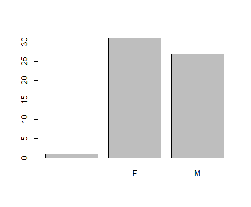

Scatter plot from 'participants_data' dataset (x=letters in first name; y=days to email response):

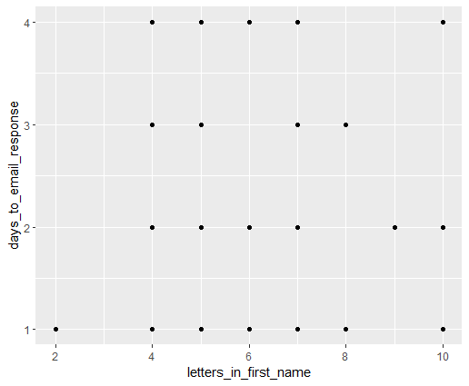

Colored scatter plot from 'participants_data' dataset with x=letters in first name; y=days to email response, academic parents (color), working hours per day as bubble sizes (size):

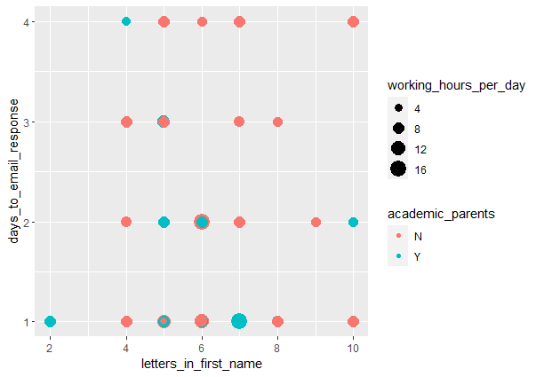

Colored scatter plot using 'iris' dataset, with petal length (y) as a function of sepal length (x) with colors representing iris species (color) and petal width as bubble sizes (size):

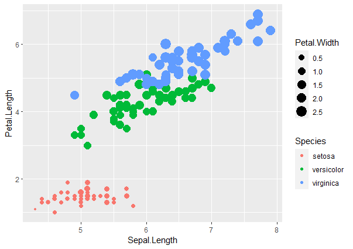

Plot of 'diamonds' data with x=carat, and y=price:

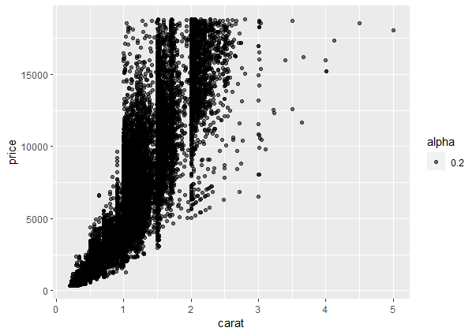

Plot of 'diamonds' data with x=log(carat), and y=log(price):

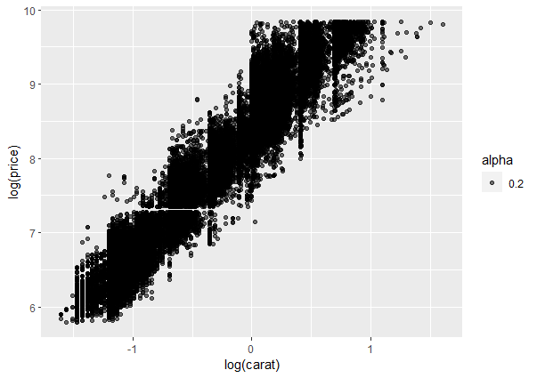

Scatter plot of 'diamonds' dataset with top 100 rows, x=carat, y=price, color=color:

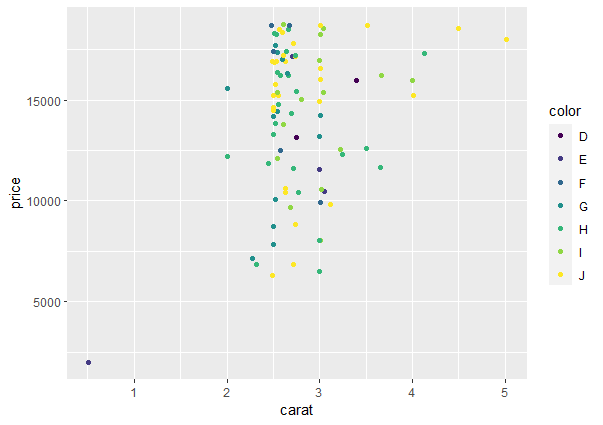

Plot of 'diamonds' dataset with top 40 rows, x=carat, y=price, shape=cut:

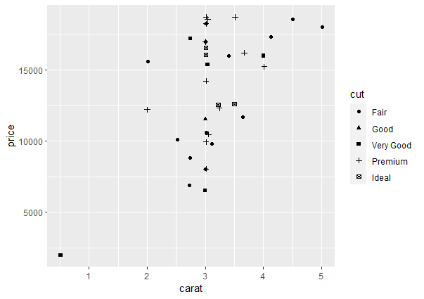

Plot of 'diamonds' dataset with x=carat, y=price, with alpha=0.1 and blue color:

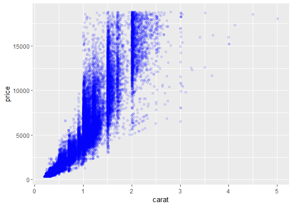

Plot of 'diamonds' dataset with top=50 rows, x=carat, y=price, smoothened using geom_smooth:

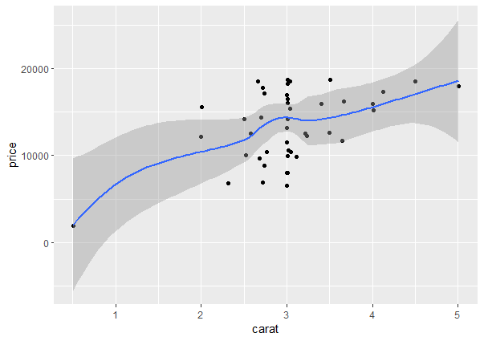

Plot of 'diamonds' dataset with top=50 rows, x=carat, y=price, smoothened using geom_smooth, 'glm' option:

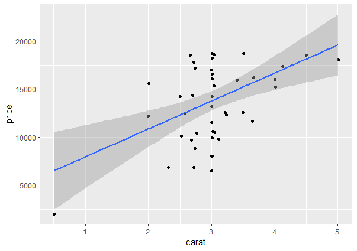

Boxplot of 'diamonds' dataset where x=cut, y=price/carat:

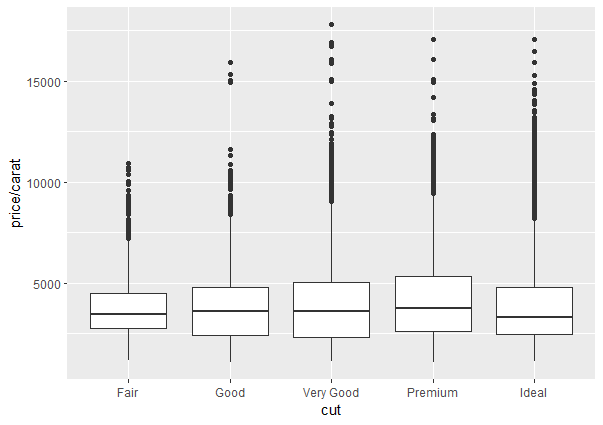

Jittered boxplot of 'diamonds' dataset wehre x-axis is cut and the y-axis is price divided by carat:

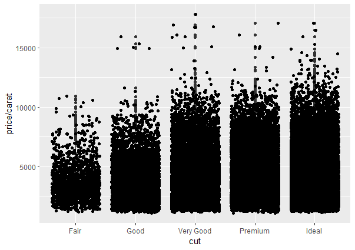

Changed alpha to 0.4:

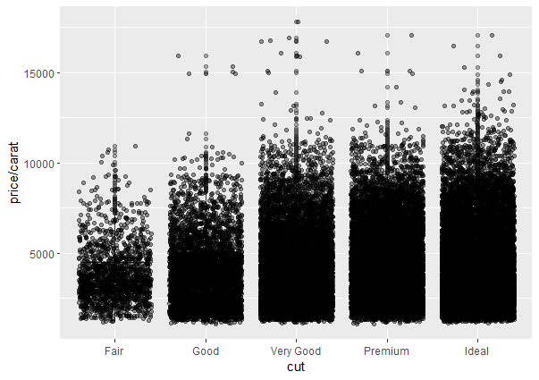

Density plot of 'diamonds' dataset where x=carat, color=color:

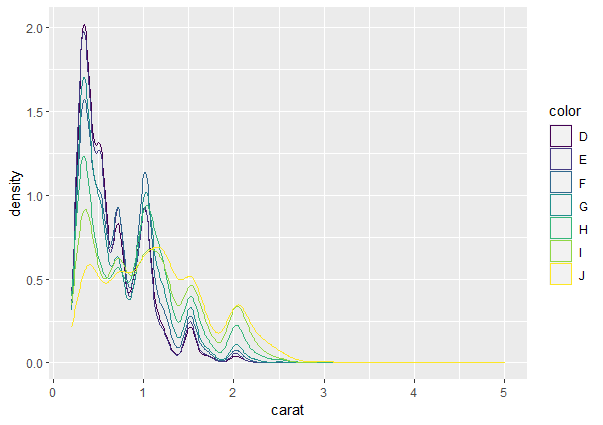

Changed transparency to 0.3:


Smooth plot of 'mpg' dataset with color=manufacturer, and linear model=lm:

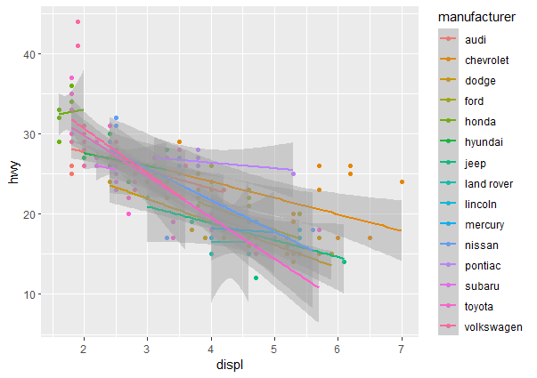

My own plot:

```{r, eval=FALSE}
library(tidyverse)
library(dplyr)
library(tidyr)
library(magrittr)
library(kableExtra)
library(ggplot2)


#I will use the 'mpg' dataset
#scatterplot:
scatter.smooth(mpg$cty)

#barchart
barplot(mpg$cyl)

#boxplot
boxplot(mpg$displ)

#custom plot with labels
ggplot(data = diamonds) +
  aes(x = carat,  alpha = I(0.5)) +
  labs(x = "carat") +
  aes(y = price) +
  labs(y = "price") +
  geom_point() +
  aes(col = table) +
  labs(col = "table") +
  labs(title = "Prices of over 50,000 round cut diamonds")

##custom analysis: correlation
part_data <- select_if(mpg, 
                       is.numeric)

cormat <- round(cor(part_data), 
                digits = 1)
melted_cormat <- as.data.frame.table(cormat, 
                                     responseName = "value")
ggplot(data = melted_cormat, 
       aes(x = Var1,
           y = Var2,
           fill = value)) + 
geom_tile()
```

Scatterplot of 'mpg' dataset 'cty' variable (smooth):

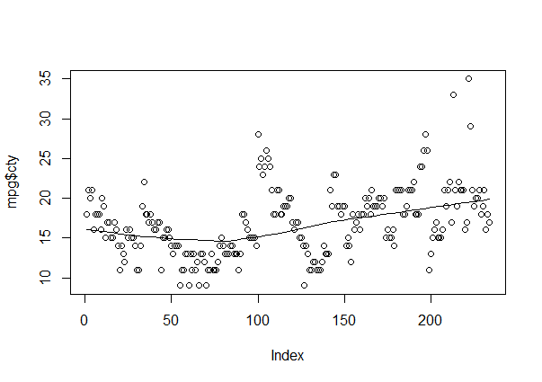

Barplot of cyl from 'mpg' dataset:

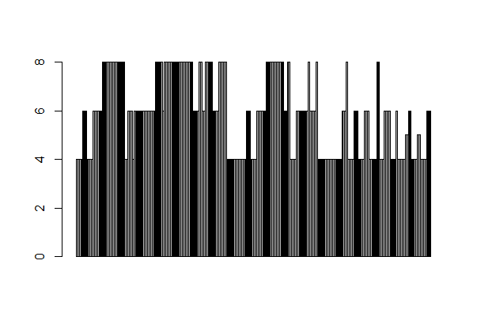

Boxplot of 'mpg' dataset disp:

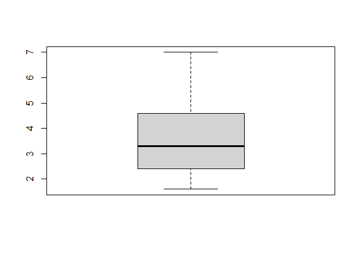

Custom plot with labels:

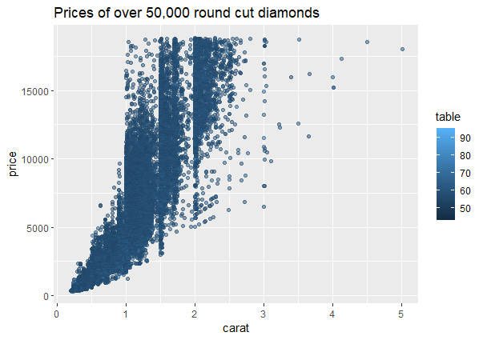

Correlation analysis using 'mpg' dataset:

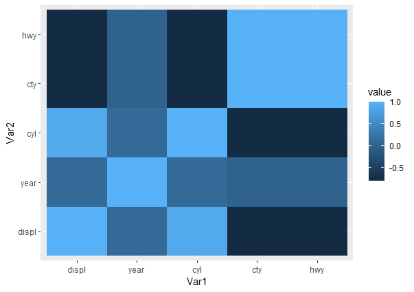

# Exercise 5

This exercise will make use of 'stakeholder' dataset from CWWhitney's github [here](https://raw.githubusercontent.com/CWWhitney/Decision_Analysis_Course/main/data/stakeholder.csv). Code is from [Giang Luu Thi Thu](https://www.linkedin.com/in/giang-luu-thi-thu-9a2b0b11b/).

```{r, eval=FALSE}
library(ggplot2)
library(ggrepel)
library(ggthemes)

stakeholder<- read.csv('data/stakeholder.csv')

#running Giang's code
ggplot(data = stakeholder, aes(x = Experience, 
                               y = Availability, 
                               label = stakeholders, 
                               color = Expertise)) + 
  geom_point(aes(shape=Gender)) +
  xlab("Relevant Experience") +
  
 #label names of stakeholders and expand space to show full names
  scale_x_continuous(labels = paste(seq(0, 5, by = 1)), 
                     breaks = seq(0, 5, by = 1), 
                     limits = c(0, 5),
                     expand = c(0, 1)) +
  scale_y_continuous(labels = paste(seq(0, 5, by = 1)), 
                     breaks = seq(0, 5, by = 1), 
                     limits = c(0, 5),
                     expand = c(0, 1)) +
  theme(plot.margin = unit(c(1, 1, 1, 1), "cm")) +
  theme(legend.position = "none") +
    
# Create line to categorize stakeholders
  geom_hline(yintercept=2.5, color="white", size=2) +
  geom_vline(xintercept=2.5, color="white", size=2) +

# Show all names of overlapped values
  geom_text_repel(box.padding = 0.3, max.overlaps = Inf, size = 3) +
  annotate("text", label = "Potential core experts",
    x = 4.5, y = 3.2, size = 5, color = "grey48") +
  annotate("text", label = "Resource persons",
           x = 4.5, y = 0.25, size = 5, color = "grey48")

```

Plot of 'stakeholder' dataset:

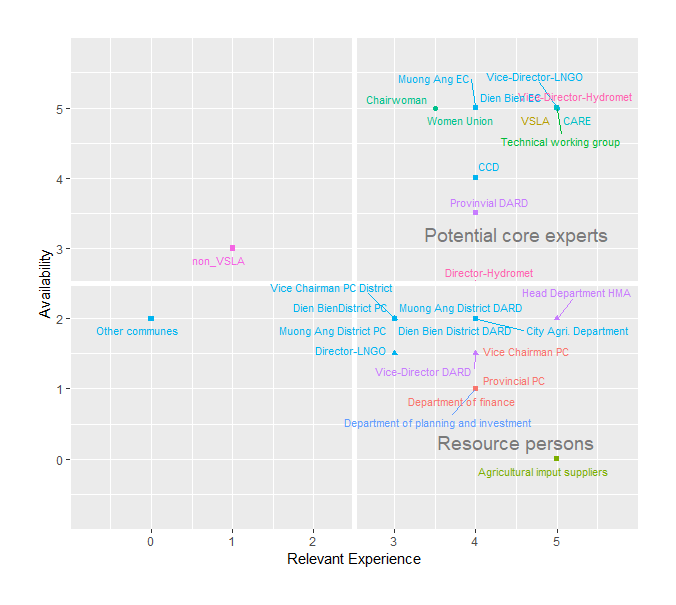

# Exercise 06

sample

# Exercise 08

This exercise makes use of the `mcSimulation` function from the `decisionSupport` package.

```{r, eval=FALSE}
library("decisionSupport")

example_decision_function <- function(x, varnames){
  
  # calculate ex-ante risks: impact the implementation of interventions ####
  intervention_NonPopInvolvEvent <-
    chance_event(intervention_NonPopInvolv, 1, 0, n = 1)
  
  # pre-calculate common random draws for all intervention model runs ####
  
  # profits from Tropical Livestock Units (TLU)
  TLU <- vv(TLU_no_intervention, var_CV, n_years)
  TLU_profit <- vv(profit_per_TLU, var_CV, n_years)
  
  # benefits of fruit
  precalc_intervention_fruit_benefits <-
    vv(intervention_fruit_area_ha, var_CV, n_years) *
    vv(intervention_fruit_yield_t_ha, var_CV, n_years) *
    vv(intervention_fruit_profit_USD_t, var_CV, n_years)
  
  # benefits of vegetables
  precalc_intervention_vegetable_benefits <-
    vv(intervention_vegetable_area_ha, var_CV, n_years) *
    vv(intervention_vegetable_yield_t_ha, var_CV, n_years) *
    vv(intervention_vegetable_profit_USD_t, var_CV, n_years)
  
  # benefits of rain-fed crops
  precalc_intervention_rainfed_crop_benefits <-
    vv(intervention_rainfed_crop_area_ha, var_CV, n_years) *
    vv(intervention_rainfed_crop_yield_t_ha, var_CV, n_years) *
    vv(intervention_rainfed_crop_profit_USD_t, var_CV, n_years)
  
  #  Intervention ####
  
  for (decision_intervention_strips in c(FALSE,TRUE)){
      
  if (decision_intervention_strips){
    
    intervention_strips <- TRUE
    intervention_strips_PlanningCost <- TRUE
    intervention_strips_cost <- TRUE
  } else
  {
    intervention_strips <- FALSE
    intervention_strips_PlanningCost <- FALSE
    intervention_strips_cost <- FALSE
  }
  
  if (intervention_NonPopInvolvEvent) {
    intervention_strips <- FALSE
    intervention_strips_cost <- FALSE
  }
  
  # Costs ####
  if (intervention_strips_cost) {
    cost_intervention_strips <-
      intervention_adaptation_cost + 
      intervention_tech_devices_cost + 
      intervention_nursery_cost +
      intervention_wells_cost +
      intervention_training_cost + 
      intervention_mngmt_oprt_cost + 
      intervention_mngmt_follow_cost +
      intervention_mngmt_audit_cost
  } else
    cost_intervention_strips <- 0
  
  if (intervention_strips_PlanningCost) {
    plan_cost_intervention_strips <-
      intervention_communication_cost + intervention_zoning_cost
  } else
    plan_cost_intervention_strips <- 0
  
  maintenance_cost <- rep(0, n_years)
  
  if (intervention_strips)
    maintenance_cost <-
    maintenance_cost + vv(maintenance_intervention_strips, 
                          var_CV, n_years)
  
  intervention_cost <- maintenance_cost
  intervention_cost[1] <-
    intervention_cost[1] + 
    cost_intervention_strips + 
    plan_cost_intervention_strips

  
  # Benefits from  cultivation in the intervention strips ####
  
  intervention_fruit_benefits <-
    as.numeric(intervention_strips) * precalc_intervention_fruit_benefits
  intervention_vegetable_benefits <-
    as.numeric(intervention_strips) * precalc_intervention_vegetable_benefits
  intervention_rainfed_crop_benefits <-
    as.numeric(intervention_strips) * precalc_intervention_rainfed_crop_benefits
  
  # Total benefits from crop production (agricultural development and riparian zone) ####
  crop_production <-
    intervention_fruit_benefits +
    intervention_vegetable_benefits +
    intervention_rainfed_crop_benefits
  
  # Benefits from livestock ####
  # The following allows considering that intervention strips may
  # restrict access to the reservoir for livestock.
  
  if (intervention_strips)
    TLU_intervention <-
    TLU * (1 + change_TLU_intervention_perc / 100)
  else
    TLU_intervention <- TLU
  
  if (decision_intervention_strips){
    livestock_benefits <- TLU_intervention * TLU_profit
    total_benefits <- crop_production + livestock_benefits
    net_benefits <- total_benefits - intervention_cost
    result_interv <- net_benefits}
  
  
  if (!decision_intervention_strips){
    livestock_benefits <- TLU_no_intervention * TLU_profit
    total_benefits <- livestock_benefits
    net_benefits <- total_benefits - intervention_cost
    result_n_interv <- net_benefits}
  
    } #close intervention loop bracket

NPV_interv <-
  discount(result_interv, discount_rate, calculate_NPV = TRUE)

NPV_n_interv <-
  discount(result_n_interv, discount_rate, calculate_NPV = TRUE)

# Beware, if you do not name your outputs 
# (left-hand side of the equal sign) in the return section, 
# the variables will be called output_1, _2, etc.

return(list(Interv_NPV = NPV_interv,
            NO_Interv_NPV = NPV_n_interv,
            NPV_decision_do = NPV_interv - NPV_n_interv,
            Cashflow_decision_do = result_interv - result_n_interv))
}
```

Using Hoa Do's input file from [github](https://raw.githubusercontent.com/CWWhitney/Decision_Analysis_Course/main/data/example_input_table.csv),

```{r, eval=FALSE}
#reading the data file and saving to a variable

input_table = read.csv("data/hoa.csv")

names(input_table)


```

## Practical

This part makes use of the `brms` package

```{r, eval=FALSE}

library (brms)
library(StanHeaders)
library(rstan)
library(ggplot2)
library(Rcpp)

#connecting the libraries
options(mc.cores = parallel::detectCores())
rstan_options(auto_write = TRUE)

#setting 2 normal distributions
priors <- c(set_prior("normal(200, 5)", coef = "rasseN"), set_prior("normal(210, 5)", coef = "rasseK"))

#plotting
curve(dnorm(x, 200, 5), from = 170, to = 230, xlab="egg production", ylab="density")

#new data
rasse <- c("K", "K", "K", "N", "N", "N", "N", "N", "N")

ll <- c(225, 222, 221, 219, 219, 216, 221, 218, 217)

daten <- data.frame(rasse=rasse, ll=ll)

#model creation
legeleistung <- brms::brm(formula = ll ~ rasse -1, data = daten , prior = priors, silent = 2)


summary(legeleistung)

plot(legeleistung)


```

## Bayesian Analysis

Combine all knowledge you have: experiment, expert data, and literature. Do parameterization, projections.

H=parameter values (hypothesis)

X= data we see

P(H\|X)=[P(X\|H)×P(H)P(X)]/P(X)

# Exercise 09

Frequentist thinking-starts from blank slate, assumes all valuable inputs only come from experimental data. Use case is for simple systems where new objective data and assessments can be obtained easily (e.g. scientific experiments with crops, laboratory settings).

Bayesian thinking- starts from initial knowledge as base point, updates assessment based on present events. Use case is for complex decision making systems where information cannot be obtained objectively from experiments (e.g. decision analysis).

Concepts:

-Prior-probability of initial belief

-Likelihood- probability of other hypothesis + new data

-Posterior- probability of revised belief

Posterior= Prior x Likelihood

```{r, eval=FALSE}
library("igraph")
library("decisionSupport")


#sample Impact pathway visualization using igraph plot
hail_path <- graph.formula(HailNet -+ Yield, 
                          HailNet -+ Cost, 
                          HailEvent -+ Yield,
                          Yield -+ MarketPrice, 
                          MarketPrice -+ NPV,
                          Cost -+ NPV)

plot(hail_path)

hail_estimates <- data.frame(variable = c("p_hail", 
                                          "yield", 
                                           "var_CV", 
                                           "initial_investment", 
                                           "price"),
                    lower = c(0.02,6000, 20, 500, 5),
                    median = NA,
                    upper = c(0.2, 14000, 20, 1000, 80),
                    distribution = c("posnorm", 
                                      "posnorm", 
                                     "const", 
                                     "posnorm", 
                                     "posnorm"),
                    label = c("% change hail", "Yield (kg/ha)", 
                              "Coefficient of variation", 
                              "Investment cost (USD)", 
                              "Market price (EUR/kg)"),
                    Description = c("Probability of a hail storm", 
                                    "Yield under normal conditions",
                                    "Coefficient of variation (measure of relative variability)",
                                    "Investment cost", 
                                    "Market price achieved for yields (EUR/kg)"))


hail_estimates

hail_function <- function(){
  
# use vv() to add variability to the 
# random draws of yield and of  price 
# over a 20 year simulation 
yields <- vv(var_mean = yield, 
             var_CV = var_CV, 
             n = 20)

prices <- vv(var_mean = price, 
             var_CV = var_CV, 
             n = 20)

# use rep() to simulate the initial_investment 
# only in the first year (assuming the net lasts 20 years)
invest_costs <- c(initial_investment, rep(0, 19))

# use p_hail in the chance_event() 
# to adjust yield for probability of hail
# assuming no yield at all in the event of hail
hail_adjusted_yield <- chance_event(chance = p_hail, 
                                    value_if = 0,
                                    value_if_not = yield,
                                    n = 20)

# calculate profit without net
profit_no_net <- hail_adjusted_yield*prices

# calculate profit with the net
profit_with_net <- (yields*prices)-invest_costs

# use 'discount' to calculate net present value 
# 'discount_rate' is expressed in percent
NPV_no_net <- discount(profit_no_net, discount_rate = 5, calculate_NPV = TRUE)
NPV_net <- discount(profit_with_net, discount_rate = 5, calculate_NPV = TRUE)

# calculate the overall NPV of the decision (do - don't do)
NPV_decision <- NPV_net-NPV_no_net

return(list(NPV_no_net =  NPV_no_net,
            NPV_net =  NPV_net, 
            NPV_decision = NPV_decision))
}

# Run the Monte Carlo simulation using the model function
hail_mc_simulation <- mcSimulation(estimate = as.estimate(hail_estimates),
                              model_function = hail_function,
                              numberOfModelRuns = 200,
                              functionSyntax = "plainNames")

hail_mc_simulation

#plot distributions
plot_distributions(mcSimulation_object = hail_mc_simulation, 
                      vars = c("NPV_no_net", "NPV_net"),
                      method = 'smooth_simple_overlay', 
                      base_size = 7)

##VOI analysis
# subset the outputs from the mcSimulation function (y) 
# to run the multi_EVPI only on the variables that the we want 
# (i.e. the NPV_decision)
mcSimulation_table_hail <- data.frame(hail_mc_simulation$x, 
                                 hail_mc_simulation$y[3])

evpi_hail <- multi_EVPI(mc = mcSimulation_table_hail, 
                   first_out_var = "NPV_decision")

plot_evpi(evpi_hail, decision_vars = "NPV_decision")
```

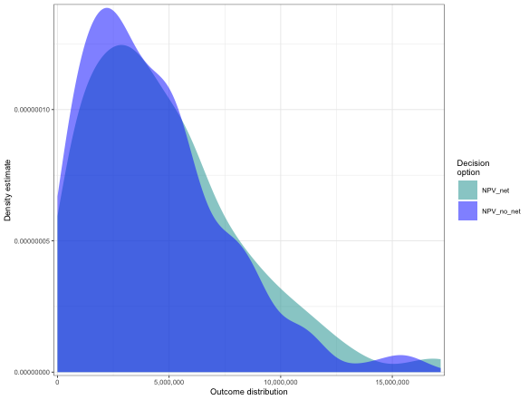

Trying out the Sediments dataset:

```{r, eval=FALSE}

```
